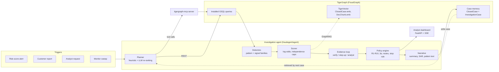

# Architecture

## Graph model

| Vertex | Key attributes | Why |
|---|---|---|
| `Customer`, `Card` | network, card type, home region, median amount | cards are rebuilt from `customer_id` + card network (99.3% match to the labelled IDs, labels override) |
| `Txn` | ts, amount, product, channel, risk, M-flags, `dev_status` (id_15), `proxy_type` (id_23), `cm_score` | one vertex per transaction (590,742) |
| `DeviceProfile` | DeviceInfo, OS, browser, screen | the id is the readable profile string the answer format expects |
| `EmailDomain`, `BillingRegion` | | shared-origin analysis (R6) |
| `ClosedCase` | outcome, pattern, exposure, notes, `emb` (vector) | historical case memory |
| `InvestigationCase` | status, verdict, probability, actions, decision log, `emb` | the agent's own cases, written back after each run |
| `FraudPattern`, `DocChunk` (`emb`) | | typologies and policy/regulatory text for GraphRAG |

Edges: `OWNS`, `MADE`, `FROM_DEVICE`, `PURCHASER_EMAIL`, `BILLED_IN`, `NEXT` (per-card sequence with gap in seconds),
`INVOLVES` / `ON_CARD` / `CONNECTED_TO` / `CASE_PATTERN` for closed cases, and `INV_*` / `SIMILAR_TO` for agent cases.

## Graph tools (installed GSQL queries)

| Tool | What it answers |
|---|---|
| `txn_detail` | the flagged transaction with card, device and region |
| `card_window` | everything on the card within ±N hours, with device / region / email context |
| `card_baseline` | the card's behaviour before the alert (regions, products, channels, devices, emails, amounts) |
| `device_neighbors` | other cards on the same device profile in a window, with proxy and New-device flags and their case history |
| `device_ring` | windowed connected component card → txn → device → txn → card (skips platform-level profiles) |
| `region_cluster` | cards new to a billing region in the same window (shared origin) |
| `recurring_matches` | earlier same-amount charges (R7) |
| `card_case_history` | closed and agent cases on the card, the customer's other cards, and as a connected card |
| `device_case_links` | closed cases on any card that used the device (2-hop memory) |
| `similar_closed_cases` | TigerVector search over closed-case profiles |
| `search_docs` | TigerVector search over policy, typologies and regulatory guidance |

The same queries are reachable through `tigergraph-mcp` (`tigergraph__run_installed_query`), so the agent can run with
`USE_TIGERGRAPH_MCP=1` and any MCP client (Claude, Copilot, LangGraph) gets the same investigation toolkit.

## Evidence scoring

Every detector emits a `Signal(claim, source, ref, entity_ids, weight, family)`. Weights are log-odds contributions.
Signals in one family (model, device, region, behaviour, sequence, network, memory, customer…) are summed and capped at
±3.2 so that one kind of evidence cannot masquerade as several; the number of families pointing the same way is the
count of *independent* evidence used by the stopping rule (policy §6).

| Family | Source |
|---|---|
| `model` | case-memory model trained on closed cases (see below) |
| `sequence` | card testing (R5), sub-$500 structuring (undocumented) |
| `network` | anonymous-proxy device ring, billing-region cluster (R6/R9) |
| `device` | New device not in the card's history, anonymising proxy, or a known device |
| `region` | first-time region for card-present use, or a familiar region |
| `behaviour` | amount vs the card's distribution, new product code |
| `recurring` | same charge in consecutive months (R7) |
| `memory` | recent confirmed fraud on the card; outcomes of the most similar closed cases, measured against the 84% confirmed-fraud base rate of the history (computed from the data) so that a vote only counts where it departs from what retrieval would return by chance |
| `customer` / `analyst` | the trigger itself and any verification response |

## The case-memory model

The bank's `risk_score` is weak (most alerts above 0.7 were cleared). The closed cases are the only labels, so a
gradient-boosted classifier is trained on them: transactions inside confirmed-fraud cases vs all other July–September
transactions, with cleared-alert transactions up-weighted as hard negatives, then calibrated with isotonic regression on
October. Holdout results (`docs/case_model_metrics.json`):

| | AUC | Average precision |
|---|---|---|
| Bank risk score | 0.866 | 0.252 |
| Case-memory model | **0.955** | **0.614** |
| Confirmed vs cleared (investigated alerts only) — bank / model | 0.052 / **0.877** | |

The score is stored on each `Txn` vertex (`cm_score`) and enters the agent as one evidence family, never as the verdict.

## Similar-case retrieval

Closed cases are embedded from a structural profile (channel, product, amount band, number of transactions, New-device
and proxy flags, sequence markers) plus the analyst notes. A new investigation is queried with the same structural
tokens and the typology phrases its detectors fired, never with free-text evidence claims, because the notes are
templated and wording would otherwise dominate similarity. Tied distances are broken by case ID so retrieval is
deterministic.

## Uncertainty and the evidence loop

1. After the graph tools, the agent scores the evidence.
2. If probability ≥ 0.85 or ≤ 0.15 with ≥ 2 independent families, it decides (policy §6). Customer disputes are always
   verified before being closed as legitimate.
3. Otherwise it records an **initial** next best action (R1: verify before blocking on weak evidence) and requests evidence:
   step-up authentication for online / new-device cases, customer validation otherwise.
4. The response is simulated from the posterior (≥ 0.55 deny, 0.42–0.55 no reply, < 0.42 confirm) and applied as a fixed
   likelihood ratio (deny ×6, confirm ×1/8). The assumption is written to `evidence_requests`.
5. The **final** actions come from the policy engine; `what_changed` explains the difference.

## Policy engine and permissions

`fraudagent/agent/policy.py` encodes the action table, approval routes (auto / L1 / L2 with the $2,500 block threshold),
rules R1–R10, the case-vs-report test (§3a) and the stopping rule. The API enforces routes: `auto` actions are executed
by the agent (simulated APIs), `L1`/`L2` actions sit in an approval queue, and an L1 approver cannot approve an L2 action.

## Case memory loop

After deciding, the agent writes an `InvestigationCase` vertex with edges to the card, affected transactions, connected
cards, devices, the pattern and the closed cases it relied on, plus an embedding of its profile. The next investigation on
the same card, device or pattern finds it through `card_case_history`, `device_case_links` or vector search.
